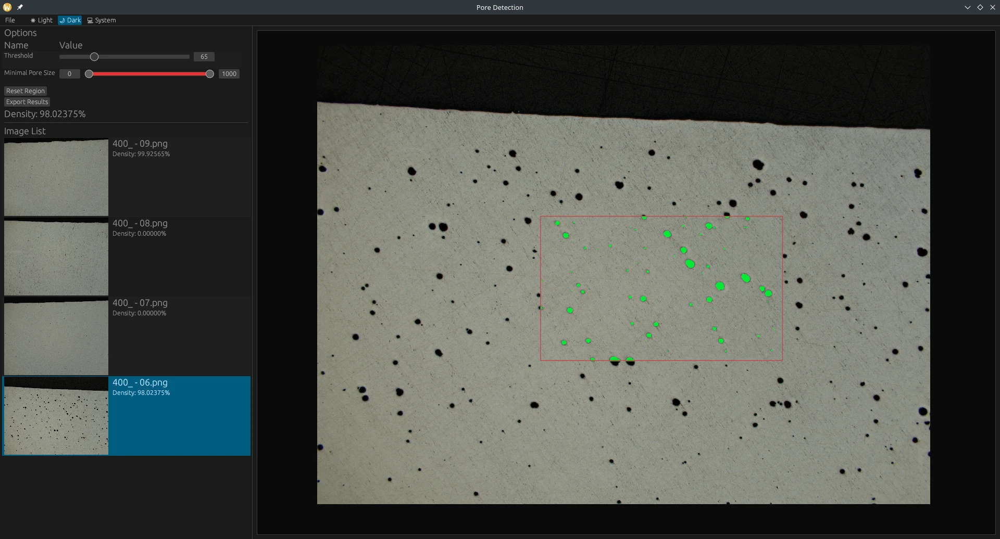

# WASM Pore Detection

The Pore Detection is a program to analyze the density of cross section images.

This Program can be used to analyze images of cross sections.
You can select a threshold and a min/max range of the pore size. This works by converting the image to grayscale.
Then all grey values are converted to black or white according to the given threshold. Then all black pixels are
counted. Each "group" of black pixels is then quantified. If the size of this group is not within the chosen
minimal pore size, its not used for the density analysis. All other pixels are colored green and shown on the screen.

## Getting started

Start by either downloading a released binary from the right hand side or head down to the [Development Guide](#development).

When you have started the program you can click on `Open Files` under the `Image List` section where you can select one or multiple
images to load.
When the images are loaded you can select one from the list and start changing the options above the `Image List`.

## Features

+ Threshold: Change the threshold for the grayscale image.
+ Minimal feature size: This is the size of the areas you still want to include into the anaylsis. Its mostly useful when a few pixels inside your pores have another color due to corosion, cracks or grinding.
+ Minimal Pore Size: This selects the lower/upper bounds for the pixel group size of the pores. Each "group" (connected by at least a single pixel) is quantified. If the number of pixels in this group is outside of the selected range, its not shown as a green pixel and therefore not used for the density analysis.
+ Zoom: Use your mouse wheel to zoom in and out. A double left click will reset the zoom.
+ Region Selection: Drag with your right mouse button to create a region for the analysis. You can reset this region with the button `Reset Region` under `Options`.
+ Density Analysis: This happens as soon as the image is loaded. Its also retriggered if you select a new threshold, pore size or create/reset the selected region. For the density the number of green pixels is divided by the number of total pixels of the image. If the threshold is too high, all pixels would become green, but a decent image size and the upper limit pore size of 1000 filters this out. So there are no longer any pixels displayed in green.
+ Export Results: This opens a new window with a table displaying all loaded images and the results of the analysis. You can then export this to an Excel table for further investigation.
+ Import Results: You can also import the already saved Excel file via `File` -> `Load from file`.

Currently supported image formats are: AVIF, BMP, JPEG/JPG, EXR, PNG, PNM, TGA and TIFF.

### Shortcuts

You can use the `Left/Right Arrow` Keys to jump to the next/previous image in the list. If you hit `Enter` all options from the previous image are applied to the new one.

## Development

Although the title contains WASM, this project is not so WASM yet.
I used the [eframe_template](https://github.com/emilk/eframe_template) to create this project but in the process
of creating some features for this program i discovered that not everything supported on native platforms is available
for WebAssembly (like `threads`). So i gave up on this part (at least for now). This remains a planned feature and will happen
as soon as i find the time for this.

For the native development:

Make sure you are using the latest version of stable rust by running `rustup update`.

`cargo run --release`

On Linux you need to first run:

`sudo apt-get install libxcb-render0-dev libxcb-shape0-dev libxcb-xfixes0-dev libxkbcommon-dev libssl-dev`

On Fedora Rawhide you need to run:

`dnf install clang clang-devel clang-tools-extra libxkbcommon-devel pkg-config openssl-devel libxcb-devel gtk3-devel atk fontconfig-devel`

